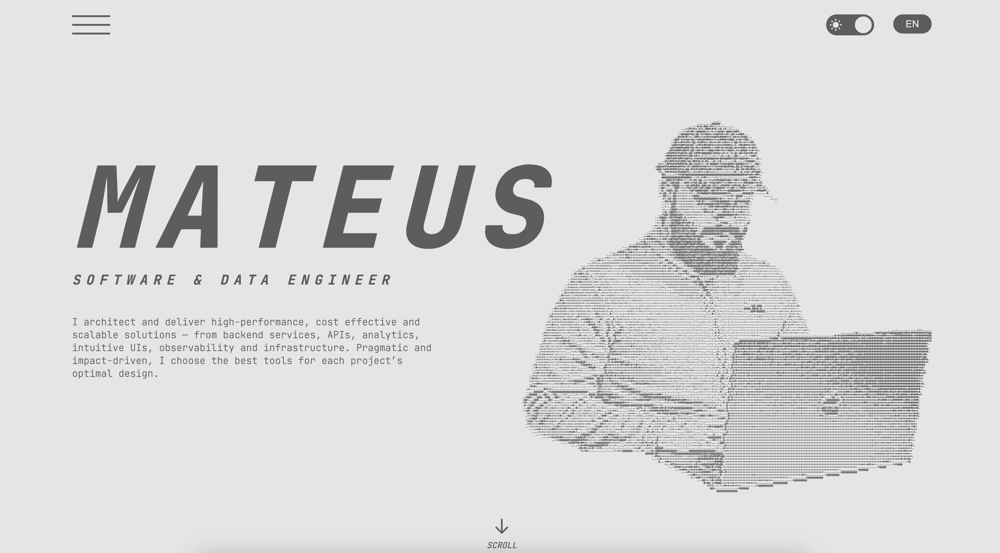

# Mateus Portfolio

Hey! This is the repository for my personal portfolio. It’s more than just a pretty site — it’s where I show what I’m capable of as a developer, both technically and creatively. Built with [Next.js](https://nextjs.org), it brings together a bunch of things I enjoy experimenting with on the modern web.



## ✨ What Stands Out

The goal here was to create a smooth, responsive, and immersive experience. The layout adjusts perfectly on any screen, but the highlight is in the details: advanced interactions like **scroll hijacking**, **parallax based on gyroscope and mouse**, and seamless transitions using [Framer Motion](https://www.framer.com/motion/). Everything is meant to feel reactive and alive.

A few more things under the hood:

- Multi-language support  
- Performance-focused (lazy loading + Next.js built-in optimizations)  
- Custom SVG icons for a polished look

## ⚙️ Tech Stack

Here’s what powers the portfolio:

- **Framework**: [Next.js](https://nextjs.org) for SSR and static generation  
- **Styling**: Modular SCSS for clean, scalable styles  
- **Animations**: [Framer Motion](https://www.framer.com/motion/) for smooth, interactive motion  
- **Icons**: Handcrafted SVGs  
- **State Management**: React Hooks  
- **Deployment**: [Vercel](https://vercel.com) for fast and automated delivery

## 🗂️ Project Structure

```plaintext
.
├── app/                # Main Next.js app directory
├── components/         # Reusable UI components
│   ├── sections/       # Main page sections
│   ├── ui/             # Smaller building blocks (cards, buttons, etc.)
├── hooks/              # Custom React hooks
├── styles/             # Global and modular SCSS files
├── public/             # Static assets like icons and images
└── README.md           # Project documentation
```

## 💡 Why I Built This

This isn’t just a project showcase. It’s a space where I push boundaries and try new ideas. I wanted something that reflects how I approach building for the web, especially when it comes to interaction design. Everything here is intentional, from the micro-animations to the way the site reacts to motion and scroll. It’s about showing how I think, not just what I’ve built.

## 🔗 Let’s Talk

Got feedback? Want to collaborate? Or just want to chat about dev or design? Hit me up. I’m always down to connect with people who love building things too.

Thank you for stopping by. I hope this project gives you some ideas or, at the very least, shows what’s possible when performance meets great interaction.
